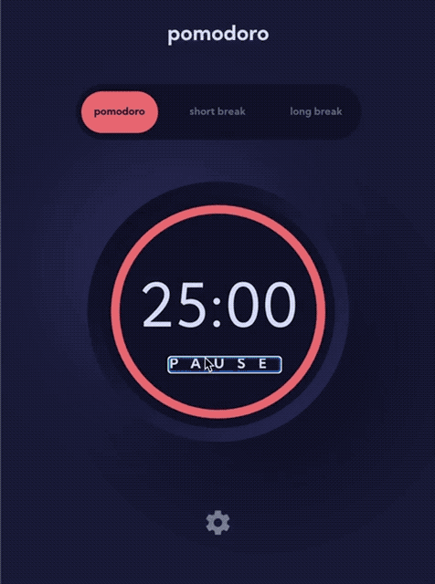

# Pomodoro React App

⏲ React Pomodoro timer + Frontend Mentor's visual design.

If you're just interested in the timer, you can [run it here](https://#).

I created this [Pomodoro](https://en.wikipedia.org/wiki/Pomodoro_Technique) app with React as a learning and documentation exercise.

The problem–or rather challenge–with tutorials and courses is that while you end up with a finished project, you don't necessarily understand how to build another project without directions.

The solution is meticulous note taking and supplementing the course with self-directed projects to further internalize the material. As a bonus, a well documented side project serves as a reference for yourself and others.



## Table of Contents

-   [Background](#background)
-   [Install](#install)
-   [Contributing](#contributing)
-   [License](#license)
-   [Author](#author)

## Background

The purpose of this project is two-fold: to create an attractive, functional [pomodoro timer](https://en.wikipedia.org/wiki/Pomodoro_Technique) and as an opportunity to implement a React app without guidance. The project started as a Figma design provided by [Frontend Mentor](https://www.frontendmentor.io).

I initially implemented the design in html/css and vanilla JavaScript, but quickly saw the value in using React to track State and render components. That's why this project uses a single css file instead of [inline styles or CSS-in-JS](https://reactjs.org/docs/faq-styling.html).

### Tech stack

Pomodoro React App uses:

-   [`React`](https://reactjs.org) for state and rendering
-   [`react-circular-progressbar`](https://github.com/kevinsqi/react-circular-progressbar) for the circular, SVG progress bar component
-   [`useSound`](https://github.com/joshwcomeau/use-sound) React Hook for playing sound effects

## Install

This module depends upon basic knowledge of [terminal](https://developer.mozilla.org/en-US/docs/Learn/Tools_and_testing/Understanding_client-side_tools/Command_line), [Node](https://nodejs.org/en/), [React](https://reactjs.org), [HTML](https://developer.mozilla.org/en-US/docs/Learn/HTML), and [CSS](https://developer.mozilla.org/en-US/docs/Learn/CSS).

[The app is live on Vercel](<(https://#)>) but if you'd like to run it locally, first clone the repo:

```
git clone https://github.com/astroud/pomodoro-react-app.git
```

<br>

Then install dependencies:

```
cd pomodoro-react-app
npm install
```

<br>

Start the app in development mode and open your browser to [http://localhost:3000/](http://localhost:3000/) to view the app. The page will reload if you make edits. You will also see any lint errors in the console.

```
npm start
```

<br>

The test runner can run in interactive watch mode. See the section about [running tests](https://facebook.github.io/create-react-app/docs/running-tests) for more information.

```
npm test
```

## Contributing

PRs accepted.

### Known Issues

Does not track your start time or save your preferences, so timer stops if your computer sleeps and the settings need to be reentered when the page is refreshed.

## License

[MIT © Oluwabusayo Jacobs.](./LICENSE)

## Author

👋 I'm a frontend web developer. #opentowork
